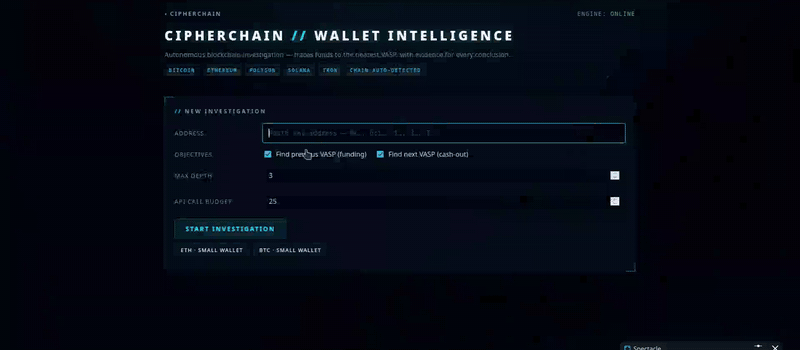
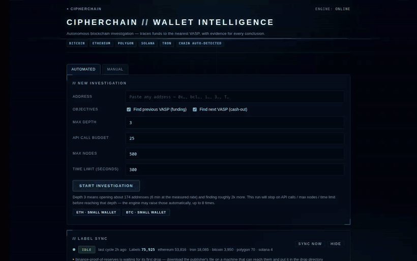
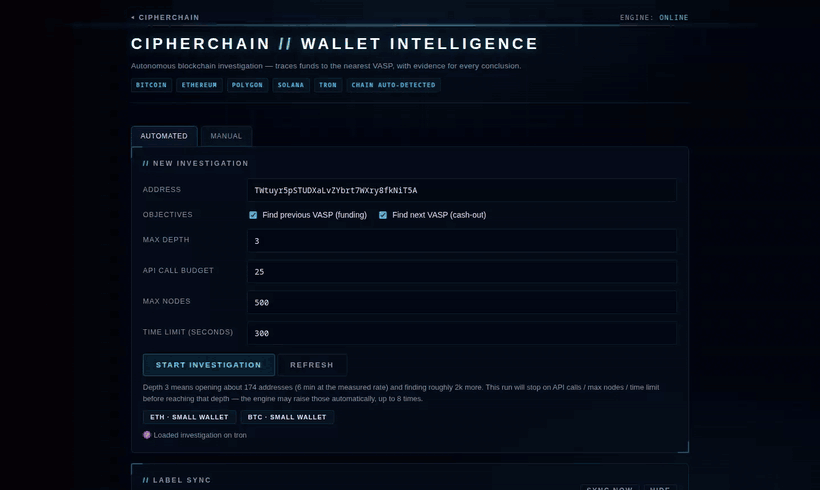
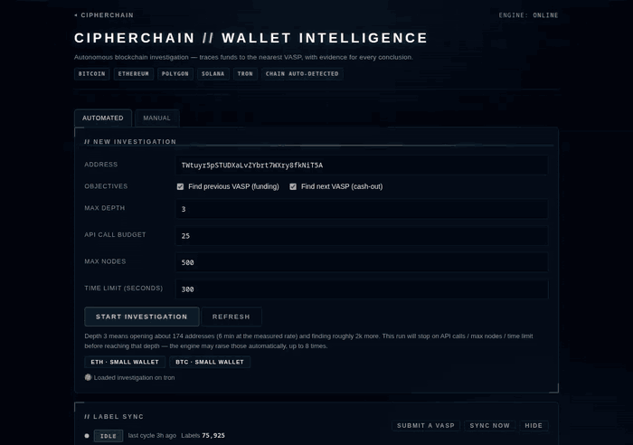
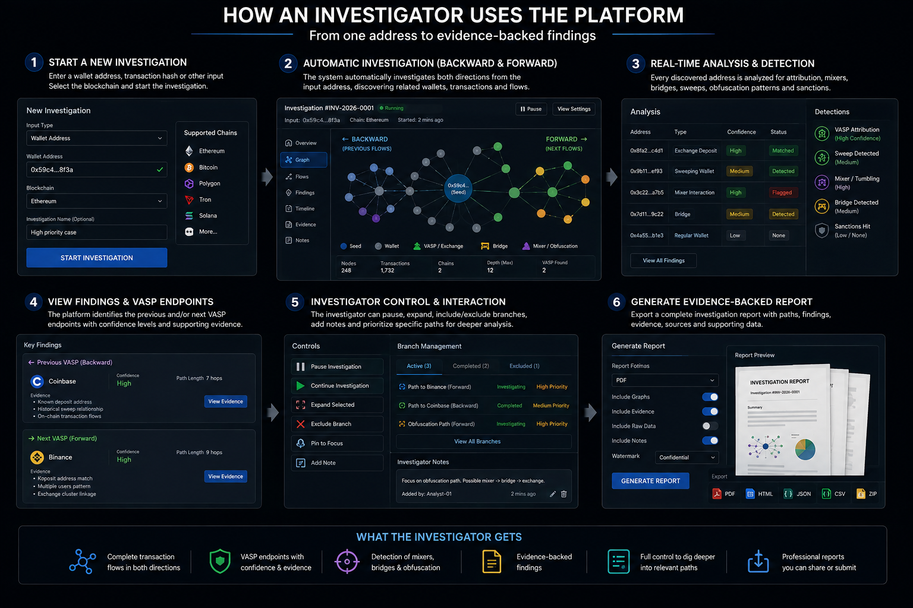
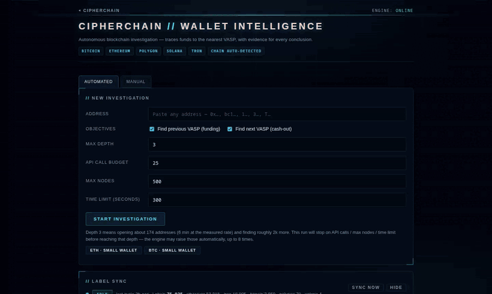
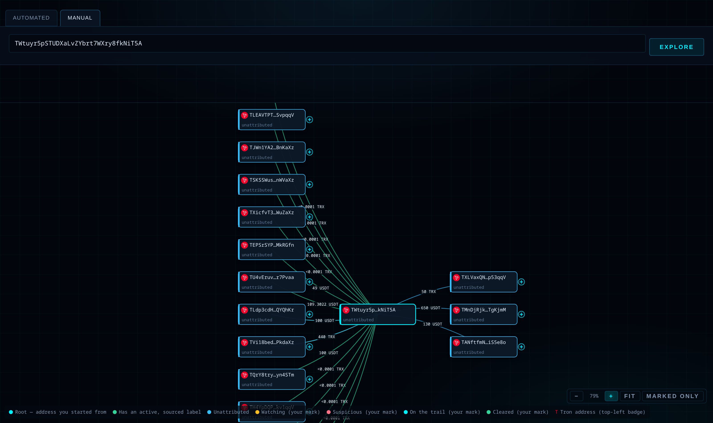
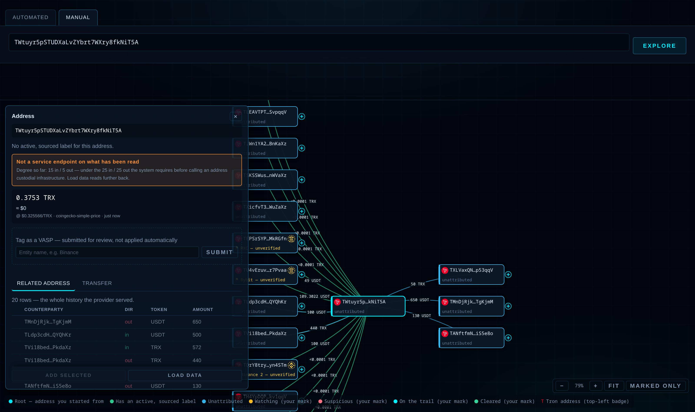
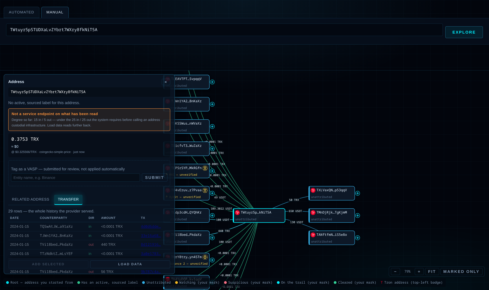
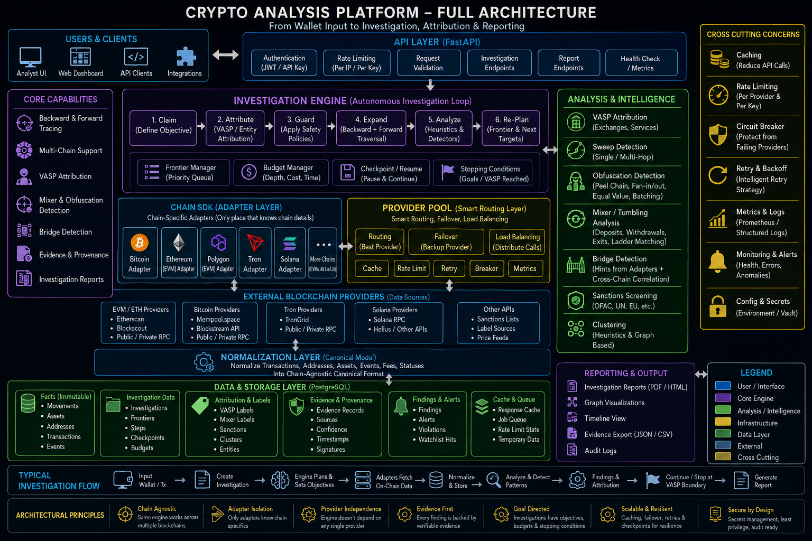

<div align="center">

# Crypto Investigation Platform

**Blockchain investigation that traces funds to the nearest exchange, and shows its working.**

Two ways to work: let the engine run the trace on its own, or drive it yourself one address at a time.

You give it one address. It walks the money backward to where the funds came from and forward to where
they went, across hops, through mixers and obfuscation patterns, until it reaches a **VASP** — a
Virtual Asset Service Provider, i.e. an exchange — that a legal request can actually be served on.

Every conclusion carries the evidence it rests on. Every gap in coverage is stated out loud.

[](LICENSE)
[](https://www.python.org/)
[](https://fastapi.tiangolo.com/)
[](https://www.postgresql.org/)
[](#testing)
[](https://mypy-lang.org/)

</div>

---

## Contents

| | |
|---|---|
| [What it does](#what-it-does) · [Why it is different](#why-it-is-different) | the idea |
| [Quick start](#quick-start) · [Configuration](#configuration) | getting it running |
| [Usage manual](#usage-manual-a-to-z) | A to Z, every screen and every flag |
| [Manual exploration](#manual-exploration) | drive the trace yourself, one node at a time |
| [API reference](#api-reference) | every endpoint |
| [Architecture](#architecture) · [Repository layout](#repository-layout) | how it is built |
| [How data is gathered](#how-data-is-gathered) | providers, and how the label database updates |
| [**Adding a VASP**](#3--adding-a-vasp-yourself) | **found one? here is how to file it** |
| [Explorer leads](#4--naming-what-behaviour-found-explorer-leads) | naming what behaviour found, without calling it evidence |
| [**Limitations**](#limitations-read-this) | **the data ceiling — read this** |
| [**Complete report (PDF)**](docs/CipherChain-complete-report.pdf) | **17 pages — plain introduction, operating guide, technical reference** |
| [Testing](#testing) · [Licence](#licence) | the rest |

---

## What it does

### 1 · Start from one address

Paste an address, pick what you want to know, set a budget. The chain is detected automatically.

<div align="center"></div>

### 2 · Watch the trace build

The engine expands outward in both directions, claiming counterparties by value share. The picture is
written as it goes, so the graph grows while you watch it. Mixers, sweeps, peel chains and
consolidation patterns are detected as they are reached.

<div align="center"></div>

Every card says what it is and on what basis. A **sourced** VASP carries its entity mark and a solid
border; a behavioural guess carries `CHECK · N%` and a dashed one. The two are never drawn alike.

<div align="center"></div>

### 3 · Get a report you can hand over

An investigation report as HTML or PDF: the money-in and money-out endpoints, the address to quote,
the confidence, the source each name rests on — and a full statement of everything the run did **not**
read.

<div align="center"></div>

---

## Why it is different

Most tools draw a graph and let you infer. This one separates **what is a fact** from **what is a
guess**, and refuses to blur them.

### The evidence taxonomy — four kinds, frozen

Every finding carries evidence, and every piece of evidence is exactly one of these:

| Kind | Means | Can it name an exchange? |
|---|---|---|
| `onchain_fact` | It is in the chain data. A transfer happened. | no |
| `heuristic_inference` | A rule fired on observed behaviour. | **no** |
| `third_party_claim` | A sourced label says so. | **yes — only this one** |
| `engine_observation` | The engine's own record of what it did. | no |

**Only a `third_party_claim` may name an operator.** An address that collects from 88 counterparties
and pays out to 27 *behaves* like custodial infrastructure — that is a `heuristic_inference`, and it
earns the words "service endpoint, operator unnamed" at ~60% confidence. It never earns the word
"Binance".

This is the whole design. A tool whose output may become a subpoena target does not get to guess at
who runs an address.

### It says what it did not read

A run that stops on a budget reports exactly what it left undone:

> Coverage is INCOMPLETE — this run did not read everything it reached: 76 address(es) read only in
> part; 1,464 address(es) queued but never explored; 12 high-degree address(es) expanded only in part;
> 657 onward branch(es) never followed.

An address that was never read cannot have been ruled out. Most tools draw what they got and let it
read as complete coverage.

### It chases the answer instead of stopping at the bill

If a run exhausts its budget with an objective still unanswered and work still queued, it raises the
budget and continues, up to a set number of extensions — because a run that stops on cost has not
answered the question, it has stopped paying for it.

**Depth is the exception, and deliberately so.** Spending more money is a cost decision; going deeper
changes what the trace *claims*. `max_depth` is never raised automatically.

---

## Quick start

**Requirements:** Node 18+, Python 3.12+, Docker. That is all — `start.sh` installs the rest.

```bash
git clone https://github.com/mania0day/crypto_investigation_platform.git
cd crypto_investigation_platform
./start.sh
```

It checks the toolchain, creates the Python venv, installs both npm trees, brings up Postgres, applies
migrations, imports ~75,000 labels, starts the services, and follows their logs.
**Ctrl-C stops everything it started.**

| | URL | |
|---|---|---|
| **Investigation UI** — start here | http://localhost:8000/ | this repository |
| **API docs** (OpenAPI) | http://localhost:8000/docs | this repository |
| Dashboard front end *(optional)* | http://localhost:5173/ | Abeera Zainab — see [NOTICE](NOTICE) |
| Dashboard API *(optional)* | http://localhost:4000/api/health | Abeera Zainab — see [NOTICE](NOTICE) |

> Everything shown in the screenshots and GIFs above is the investigation UI on **port 8000**
> (`backend/static/index.html`) — part of this project. The React dashboard on port 5173 is a
> separate, optional front end by another author and is not needed to run an investigation.

```bash
./start.sh --no-follow   # start, print the URLs, hand the terminal back
./start.sh --stop        # stop whatever a previous run started
./start.sh --no-install  # skip the dependency step on repeat runs

SERVER_PORT=4001 CLIENT_PORT=5174 BACKEND_PORT=8001 ./start.sh   # if a port is taken
```

Logs land in `logs/` — one file per service, plus `logs/install.log`.

<details>
<summary><b>Starting each piece by hand</b></summary>

```bash
cd backend
python3 -m venv .venv
.venv/bin/pip install -e '.[dev]'
./scripts/demo.sh          # postgres + migrations + labels + server on :8000
```

`demo.sh` mints a scoped API key and prints it. The bundled UI is served with that key embedded, which
is why it binds to `127.0.0.1` and nowhere else.

</details>

---

## Configuration

Everything is optional. The platform runs with **no keys at all** — TronGrid, Blockscout and the
public explorer tier are all keyless. Keys only raise rate limits and add fallbacks.

Copy `.env.example` to `.env` in the repository root:

```bash
ETHERSCAN_API_KEY=          # indexed history
TRONGRID_API_KEY=           # raises Tron from 2 to 5 requests/sec
DRPC_API_KEY=               # raw JSON-RPC pool
ANKR_API_KEY=
INFURA_API_KEY=
ALCHEMY_API_KEY=
# ... see .env.example for the full list

# AUTH_ENABLED=false        # local only. Defaults to ON.
```

> **Auth is on by default.** Every route except `/healthz` needs a key. Mint one with
> `python backend/scripts/manage_api_keys.py mint --scopes read,investigate`.
> Turning auth off is for a laptop, never a deployment.

The optional dashboard in `server/` needs its own `server/.env` with `BITCOIN_API_KEY`,
`ETHERSCAN_API_KEY` and `TRONGRID_API_KEY`. It is not required for the investigation engine.

---

## Usage manual (A to Z)

<div align="center"></div>

<sub>The workflow end to end. Steps 1–4 and 6 are what the platform does today; step 5's branch
controls (pause, exclude, pin, notes) and the JSON/CSV/ZIP exports are planned — the shipped report
formats are HTML and PDF.</sub>

### A · Starting an investigation

**From the UI** — open http://localhost:8000/ and fill in the form:

| Field | What it means |
|---|---|
| **Address** | The subject. Chain is auto-detected by probing each candidate chain for history. |
| **Objectives** | `find_prev_vasp` (where funds came from) and/or `find_next_vasp` (where they went). At least one. |
| **Max depth** | How many hops out it may walk. **This is the setting that matters most** — see below. |
| **API call budget** | How many provider requests it may spend. |

**From the API:**

```bash
KEY='cc_….…'    # printed by start.sh, also in logs/backend.log

curl -s -X POST http://127.0.0.1:8000/investigations \
  -H "Authorization: Bearer $KEY" -H 'content-type: application/json' \
  -d '{
        "address": "TWtuyr5pSTUDXaLvZYbrt7WXry8fkNiT5A",
        "chain": "tron",
        "objectives": ["find_prev_vasp", "find_next_vasp"],
        "budgets": {"api_calls": 2000, "max_depth": 8, "max_nodes": 50000, "seconds": 7200}
      }'
```

### B · Choosing budgets — the part people get wrong

Six numbers control a run. Every one of them is explained below with figures taken from real
traces in this repository's own database, not from an estimate.

#### What depth actually means

Depth is **how many hops from your subject** the trace will follow.

```
depth 0    the address you typed
depth 1    everyone who paid it, and everyone it paid
depth 2    everyone who paid them
depth 3    …and so on outward
```

The reason depth is the budget people get wrong is that it is not linear. Here is the real shape of
a Tron trace from this repo, counted per hop:

| Hop | Addresses discovered | Growth |
|---:|---:|---|
| 0 | 1 | — |
| 1 | 20 | ×20 |
| 2 | 153 | ×7.7 |
| 3 | 1,732 | ×11.3 |
| 4 | **12,737** | ×7.4 |

**Every hop multiplies the work by roughly 8–11×.** That single fact governs everything else on
this page.

#### How deep can you actually go?

There is no cap in the software — the API accepts any depth ≥ 1, and the `max="10"` on the form is
just an input hint. The arithmetic is the cap.

Reaching depth *N* means opening every address found at every hop before it. The same trace measured
**1,462 addresses opened in 2,872 seconds — about 1,800 per hour**, on a free TronGrid key with the
fallback tiers behind it. From those two measurements:

| Reach depth | Addresses to open | At ~1,800/hour | Verdict |
|---:|---:|---|---|
| 4 | 1,906 | ~1 hour | measured — this is the run above |
| 5 | ~14,600 | **~8 hours** | the practical ceiling on one machine |
| 6 | ~129,000 | ~3 days | possible, rarely worth it |
| 7 | ~1,200,000 | ~4 weeks | not realistic without a cluster |

The New investigation form shows this estimate live as you change the numbers, and names which of
your four budgets will stop the run first.

A paid provider key raises the rate limit and moves those numbers, but not the shape: each hop still
costs 8–11× the one before it, so one extra hop is always roughly one extra order of magnitude.

> **Depth will not buy you more names.** The depth-4 run above covered 14,643 addresses across
> 176,294 transactions and found **zero** new named operators. On Tron that is not a search failure,
> it is the label ceiling — see [Limitations](#limitations-read-this). Raise depth when a trace
> stops too early; do not raise it hoping a VASP appears.

#### The other five

| Budget | Min | Max | Default | Raised automatically? | What one unit buys |
|---|---:|---|---:|---|---|
| `max_depth` | 1 | **none** | 6 | **NEVER** | one more hop — see above |
| `api_calls` | 1 | **none** | 100 | yes | **one address opened**, not one HTTP request |
| `seconds` | >0 | **none** | 300 | yes | one second of wall clock |
| `max_nodes` | 1 | **none** | 500 | yes | one address held in the trace |
| `max_extensions` | 0 | **none** | 8 | — | one automatic raise of the three above |
| `pursue_until_answered` | — | — | `true` | — | switch off for a fixed, predictable spend |

**There is no upper limit on any of them.** The engine validates only that they are positive
(`max_extensions` may be 0, meaning "never raise anything"). `max_depth: 40` is accepted; it will
simply never finish. The ceilings that matter are the ones in the table above this one, and they are
arithmetic, not policy.

All four spending budgets are on the New investigation form. Set them together — three of them
defend each other and the fourth, `max_depth`, is usually the one that actually binds.

**`api_calls` is the one most often misread.** It charges **one unit per address expanded**, not per
network request. Opening one address fetches up to 100 transactions and can create dozens of new
nodes from their counterparties. In the depth-4 run, **1,462 calls produced 14,643 nodes** — about
ten nodes per unit of budget. Behind those 1,462 units the provider pool may have made considerably
more actual requests (retries, failover down the tiers, paging); the budget counts addresses opened,
because that is the unit you can reason about.

#### What "raised automatically" really does

When a cost budget runs out and an objective is still unanswered, the engine grants itself more and
keeps going — up to `max_extensions` times. This is on by default, and it means **the number you
type is a starting point, not a ceiling.**

A real run from this database asked for very little and spent six times as much:

```
asked for   api_calls 25    max_nodes 500     max_depth 3   seconds 300
spent       api_calls 150   nodes 1,901       hop 3         seconds 260

extensions  api_calls  25 → 50 → 75 → 100 → 125 → 150
            max_nodes  500 → 1000 → 1500 → 2000
            8 of 8 used, objective find_next_vasp still unanswered
```

Read the last line carefully. It burned every extension it was allowed and **still did not answer**,
because `max_depth: 3` was the actual constraint and depth is the one budget that never raises
itself. All eight extensions were spent exploring *wider at the same shallow depth*.

> **The single most common mistake, in one sentence:** leaving `max_depth` low. If a direction is
> not answering, **raise depth first** — raising anything else just buys a more thorough search of
> ground the trace has already covered.

#### Suggested starting points

| You want | `max_depth` | `api_calls` | `max_nodes` | `seconds` |
|---|---:|---:|---:|---:|
| A quick look | 3 | 50 | 500 | 300 |
| A normal case | 5 | 500 | 5,000 | 1,800 |
| Exhaust the question | 8 | 5,000 | 100,000 | 7,200 |

Nothing is lost by stopping early. A run that hits a budget finishes as `partial`, records exactly
which branches it did not read, and can be resumed later with a larger budget — it does not start
over. See [F · Resuming a run](#f--resuming-a-run).

### C · Reading the graph

Left of centre is where the money came **from**; right is where it **went**. The subject sits in the
middle.

**Controls:** `Fit` · `−` / `+` zoom · `Expand frontier` (unfold the collapsed unexplored cards) ·
`Full screen` · `Minimize`.

**Node colours and marks**

| Mark | Meaning |
|---|---|
| Root | The address under investigation. |
| **Suspected VASP** | Behaves like an exchange. Unconfirmed — worth checking. |
| **Obfuscation pattern** | Peel chain, splitter, consolidation, relay or equal-value split. |
| *Unattributed* | The claim rests on inference only, with no sourced label. |
| `⋯` | History was read only in part. |
| `↩` | Returns to an address already placed at the same or a nearer hop. |
| Dashed edge | **Speculative** — the link crosses a mixer and may not hold. |

The graph is **bounded for legibility, not for coverage**. The note under it always states how many of
the total addresses are being drawn. Nodes carrying a sourced label or an answer are always drawn,
along with the path back to the root, so the address the answer names is never missing from the
picture.

### D · Reading the answer

Each direction reports up to two things, and both matter:

- **Nearest endpoint** — the closest thing to an exchange, which may be an unnamed behavioural
  inference at ~60%.
- **Nearest NAMED endpoint** — the closest one a source actually names, which may be further away
  but is the one you can serve a request on.

Reporting only one of these would either hide a named exchange behind a nearer guess, or hide the
nearer endpoint behind a further one.

If nothing can be named, it says so plainly: *"No endpoint in this direction carries a sourced label,
so no operator can be named."* It does not promote a guess to fill the space.

### E · The status banner

| Banner | Means |
|---|---|
| `Answered · coverage complete` | Objectives met, frontier ran dry. |
| `Answered · coverage partial` | Objectives met, but the run stopped with work queued. |
| `Partly answered · coverage partial` | One direction answered, one not. |
| `Not answered · coverage partial` | Stopped on a budget with nothing named. |

### F · Resuming a run

A run that stopped on a budget has status `partial` and can be picked up where it left off:

```bash
curl -s -X POST http://127.0.0.1:8000/investigations/<id>/resume \
  -H "Authorization: Bearer $KEY" -H 'content-type: application/json' \
  -d '{"budgets":{"api_calls":6000,"max_depth":10,"max_nodes":100000,"seconds":7200}}'
```

**Budgets must exceed what is already spent**, or the API refuses with a `422` naming what to raise —
because resuming on a spent budget would exhaust on the first check and write a second identical
partial result that looks like progress.

> **Only `partial` is resumable.** `completed` means the question is closed; `failed` needs diagnosis.
> If a server is killed mid-run the status stays `running` and the investigation is stranded — the
> data is safe (every node, edge and finding is written to Postgres as the engine expands, nothing is
> buffered), but you must set it back to `partial` to resume it.

### G · The report

Press **Download PDF** in the UI, or:

```bash
curl -s -H "Authorization: Bearer $KEY" \
  "http://127.0.0.1:8000/investigations/<id>/report?format=pdf" -o report.pdf
```

The report opens with a **money-in / money-out summary** — the operator name if one exists, the full
address to quote, hop distance, confidence, and the source the name rests on. Below that sit the
per-direction answers, every finding with its evidence, and a **Coverage and caveats** section stating
every gap in full.

`?format=html` returns the same document as a page. Both are printed from the same rendered HTML, so
the file in the case record cannot say something different from the page on screen.

### H · Reading confidence numbers

Confidence is a property of the *claim*, not a probability that you have caught someone.

| Range | Typically |
|---|---|
| 0.90 | A signature-verified proof-of-reserves label. The strongest thing here. |
| 0.75–0.95 | Behavioural patterns: sweep, peel, consolidation, relay. |
| 0.55–0.65 | Service-endpoint inference — "this behaves like an exchange", no name. |

A 90% named endpoint two hops away is worth more than a 63% unnamed one at one hop. That is why both
are reported.

---

## Manual exploration

The engine decides for itself where to go. Sometimes you want to decide instead — follow one
counterparty because you recognise it, ignore the other twenty, and stop when you have what you came
for. The **Manual** tab is that: the same chain data, opened one address at a time by hand.

<div align="center"></div>

<sub>Explore an address · expand a counterparty with `+` · open its panel · read the transfers · mark it
and prune to what you marked.</sub>

Flow reads left to right: money **in** on the left, the address you started from in the centre, money
**out** on the right. Positions are fixed — a node never drifts, and expanding something on one side
does not shuffle what you were already reading. Pan by dragging the plane, zoom with `−` / `+` / `Fit`.

<div align="center"></div>

### The panel

Click any node to open it.

<div align="center"></div>

Top to bottom, and in that order because it is an order of confidence:

| Block | What it is |
|---|---|
| **What this address is** | Green = an active, sourced label. Amber = either the system's own read (`SEEMS VASP · N%`) or a public explorer's name (`⚑ Bybit — unverified`). The two ambers are never mixed with the green. |
| **Balance** | Live, never cached, with the USD conversion showing its price source and age — `@ $0.3256/TRX · coingecko-simple-price · just now`. Staked TRX is listed separately from spendable. |
| **Tag as a VASP** | Your own name for the address. Files as `pending`, exactly like an explorer tag — see [Adding a VASP](#3--adding-a-vasp-yourself). |
| **Related Address / Transfer** | The data behind the picture. |

### Related Address, and Transfer

**Related Address** is who this address dealt with, folded to one row each. Tick the rows worth
following and **Add selected** puts only those on the canvas — on an address with 200 counterparties,
that is the difference between a readable graph and a wall.

**Transfer** is the same history unfolded — every movement, with its date, amount and a transaction
hash that links out to a block explorer so any row can be checked.

<div align="center"></div>

Both tabs read one page of history at a time and say so. **Load data** reads further back and appends;
the count line moves with it (`25 of 65 read so far — bounded for legibility, not coverage`).

### Marking, and pruning to what you marked

Four marks — Watching, Suspicious, On the trail, Cleared — plus free-text notes. **Marked only** then
hides everything else, so a trace of two hundred nodes collapses to the six you cared about. Nothing
is deleted; one more click brings it all back.

> **Marks and notes live in your browser** (`localStorage`), not on the server. They are yours, they
> do not reach a report, and they do not survive clearing site data.

### What it deliberately does not do

Manual exploration is **unpersisted**: no investigation record, no findings, no evidence, no report.
It spends no engine budget and runs no heuristics on your behalf — except one. The `SEEMS VASP · N%`
mark applies the *same* thresholds and confidence curve the autonomous engine uses
(`analysis/heuristics/service.py`), so the two can never drift apart. It is computed from the history
read **so far**, which is why it can say "not a service endpoint on what has been read" and change
its mind after `Load data`. It identifies a **role**, never an identity — naming an operator still
needs a sourced label.

---

## API reference

All routes except `/healthz` require `Authorization: Bearer <key>`.

| Method | Route | Scope | Purpose |
|---|---|---|---|
| `GET` | `/healthz` | — | Liveness. |
| `GET` | `/metrics` | `read` | Provider and engine counters. |
| `POST` | `/investigations` | `investigate` | Start a run. Returns the id immediately; the run continues in the background. |
| `GET` | `/investigations/{id}` | `read` | Status, budgets, spend, and every budget extension it granted. |
| `GET` | `/investigations/{id}/findings` | `read` | Every finding with its evidence, plus the selected answers. |
| `GET` | `/investigations/{id}/graph` | `read` | The traversal graph. Takes `?limit=` and `?per_level=`. Readable **while the run is going**. |
| `GET` | `/investigations/{id}/report` | `read` | The report. `?format=html\|pdf`. |
| `POST` | `/investigations/{id}/leads` | `investigate` | Ask a public explorer to **name** the endpoints this run could not. Returns 202; names arrive as unverified leads on the graph. |
| `POST` | `/investigations/{id}/resume` | `investigate` | Continue a `partial` run on fresh budgets. |
| `POST` | `/harvest/run` | `investigate` | Start one label-harvest cycle. 202 immediately; 409 if one is already running. |
| `GET` | `/harvest/status` | `read` | What the Label sync panel reads — per-source outcomes and label counts. |
| `GET` | `/` | — | The bundled UI. |

**Manual exploration** — the routes behind the [Manual tab](#manual-exploration). None of them creates
an investigation, spends engine budget, or writes a finding.

| Method | Route | Scope | Purpose |
|---|---|---|---|
| `GET` | `/addresses/{address}/expand` | `investigate` | One hop of counterparties from a single history page. `?chain=` `?limit=` (default 25, clamped 1–100) `?cursor=`. Also returns `service_endpoint` — the degree measured, and whether it cleared the VASP thresholds. |
| `GET` | `/addresses/{address}/transfers` | `investigate` | The individual movements behind those counterparties. `?limit=` (default 50, clamped 1–200) `?cursor=`. |
| `GET` | `/addresses/{address}/balance` | `investigate` | Live holdings plus USD. Keeps `unavailable` (could not read) and `price_unavailable` (read it, could not price it) strictly apart — a balance is **never** reported as `"0"` because nobody could read it. |
| `POST` | `/addresses/leads` | `investigate` | Ask a public explorer to name 1–12 addresses at once. Tron only today; other chains answer `unsupported_chain`. |
| `POST` | `/addresses/{address}/label` | `investigate` | File your own name for an address. Arrives `pending`, never `active`. |

> These five share **one budget of 30 calls per key per rolling minute** (HTTP 429 past it). They each
> make a live chain-API call, and they sit outside `Budgets`, which only governs a started
> investigation — so this limit is the only ceiling on them.

Interactive docs at `/docs`.

---

## Architecture

<div align="center"></div>

**The seams that matter:**

- **Chain SDK** is the *only* place that knows chain specifics. Everything above it works on a
  canonical model of addresses, transactions, movements and assets, so the engine is chain-agnostic.
- **Provider pool** routes by priority and fails over: keyed providers first, then the keyless API
  tier, then public explorer pages read at crawl speed. A trace that runs out of allowance should slow
  down, not stop.
- **Investigation engine** is a loop: claim → attribute → guard → expand → analyse → re-plan. It holds
  a frontier, a budget, and stopping conditions.
- **Evidence** is attached at the point a finding is made, never reconstructed afterwards.

---

## Repository layout

```
crypto_investigation_platform/
├── backend/                     the investigation engine — this is the project
│   ├── src/cipherchain/
│   │   ├── api/                 FastAPI app, routes, auth, schemas
│   │   ├── chains/              the ONLY place that knows chain specifics
│   │   │   ├── bitcoin/           UTXO adapter
│   │   │   ├── evm/               Ethereum, Polygon
│   │   │   ├── solana/
│   │   │   └── tron/
│   │   ├── providers/           pool, failover, rate limits, circuit breaker, cache
│   │   │   └── clients/           etherscan, evmrpc, blockscout, trongrid,
│   │   │                          mempoolspace, solanarpc, explorer_fetch
│   │   ├── investigation/       the engine: frontier, budgets, objectives, answers
│   │   │                        + manual_expand.py — one-hop lookup, outside the engine loop
│   │   ├── analysis/            heuristics, mixers, clustering, sanctions, attribution
│   │   ├── intel/               attribution policy — what may become a citable label
│   │   │                        + prices.py — USD quotes (a market claim, not attribution)
│   │   ├── harvest/             daily label harvest: OFAC SDN, proof-of-reserves
│   │   ├── reporting/           the report model, HTML and PDF rendering
│   │   ├── storage/             SQLAlchemy tables and repositories
│   │   ├── graph/               traversal graph construction
│   │   └── core/                canonical model, config, evidence taxonomy
│   ├── migrations/              Alembic
│   ├── scripts/                 demo.sh, harvest.sh, label import, key management
│   ├── static/index.html        the bundled UI (Manual mode loads force-graph from a CDN)
│   └── tests/                   1228 tests
├── labels/                      address attribution packs (~75,000 rows)
├── assets/                      verified asset registry
├── bridges/                     cross-chain bridge reference data
├── docs/                        API reference, case study, research notes
├── images/                      README media
│
│   NOT this project's code — included so the stack runs end to end:
├── client/                      React landing/login/signup/dashboard — Abeera Zainab, see NOTICE
├── server/                      Express bitcoin/ethereum/tron routes — Abeera Zainab, see NOTICE
└── start.sh                     one command from a fresh clone to a running stack
```

---

## How data is gathered

Two entirely separate pipelines. Confusing them is the source of most misunderstanding about what this
tool can and cannot do.

### 1 · Chain data — live, per investigation

A provider pool with priority failover. Lower number wins; it falls through only when the one above
fails or spends its quota.

| Chain | Ladder |
|---|---|
| Ethereum / Polygon | Etherscan → RPC pool (dRPC, Ankr, Infura, Alchemy, QuickNode, Chainstack) → Blockscout → public explorer pages |
| Bitcoin | mempool.space → Blockscout |
| Tron | TronGrid → public explorer pages |
| Solana | Solana RPC |

Responses are cached, then normalised into a canonical model. Rate limits, retries and a circuit
breaker sit in front of every provider.

### 2 · Label data — batch, out of band

This is what lets the platform say a *name*, and it is completely separate from chain data. A chain
API can tell you what moved; it can never tell you who owns anything. There is no name field on a
blockchain. So every name in a report traces back to a document somebody published.

#### What is admitted, and what is not

Only three kinds of claim arrive **active** — able to name an endpoint in a report:

| Method | What it means | In this store |
|---|---|---:|
| `signature` | the operator signed a message with the key. Survives them disappearing, because anyone can re-verify it | 36,049 |
| `first_party_published` | the operator published the list themselves, and you can point at where | 1,036 |
| `licensed_dataset` | a vendor you hold a licence from published it | 38,809 |

Anything else arrives **`pending`**: stored, auditable, and unable to name anything until an
independent trusted source agrees. Community lists are refused for a concrete reason — an entry like
`Binance (successor wallet 0xATTACKER)` stems to "binance", promotes against real Binance data, and
becomes an active citable label attributing an attacker's wallet to an exchange. A review
demonstrated exactly that.

#### How the label database gets updated

One cycle per day, as its own process that exits — not a loop, and not a thread inside the API, or
"restart the API" and "skip a harvest" become the same action.

| Source | Transport | Why |
|---|---|---|
| OFAC SDN | **automatic** | ~28 MB, a few minutes. The long pole of the cycle |
| Coinbase cbBTC reserves | **automatic** | `robots.txt` permits it and the page is server-rendered |
| Binance PoR | **manual drop** | the page answers HTTP 202 with an empty body — a bot check |
| OKX PoR | **manual drop** | the page is a JavaScript shell; the download URL returns HTML, not CSV |

Binance and OKX will not become automatic. Getting past a bot check means executing it or
impersonating a browser, which is the same boundary the scraping tier holds.

Three ways to run a cycle:

```sh
# 1. the dashboard — press "Sync now" on the Label sync panel
# 2. by hand
DATABASE_URL=... ./scripts/harvest.sh
# 3. daily on a server (see backend/deploy/README.md)
sudo systemctl enable --now cipherchain-harvest.timer
```

The **Label sync** panel shows what happened: `syncing` / `idle` / `stalled` / `never_run`, each
source's publication date and age, and a line per source saying what a human has to do. A source
nobody has ever supplied reads *awaiting first drop* in grey — not red, because Binance and OKX can
never supply themselves and a panel that is red every morning is one nobody reads. A drop that was
working and then vanished **does** turn red: from that moment coverage is ageing silently.

> Exit codes are the cron mail: `0` fine · `1` a source broke or reconcile failed · `2`
> misconfigured, nothing ran · `3` nothing failed and a publisher has gone quiet.

### 3 · Adding a VASP yourself

> There is also a **Tag as a VASP** box in the [Manual tab](#manual-exploration) (`POST /addresses/{address}/label`). It files the claim exactly as this section describes — method `community`, status `pending` — so it can be seen and corroborated, but cannot name an endpoint until something trusted agrees with it.

Short answer to the common question — *I found a VASP during an investigation, can I just enter the
address?* **You can add it, but you must say where you learned it.** The engine will not let you
type in a name and have it become citable evidence, and that restriction is the product working.

#### If you have the operator's published file

This is the case for Binance and OKX, the two sources the daily cycle is wired for. Download the
file in a browser on a machine that can reach them, then:

```sh
python scripts/add_vasp.py \
  --entity "Binance" --chain tron \
  --source-date 2026-08-14 \
  --source-url https://www.binance.com/en/proof-of-reserves \
  --method first_party_published \
  --drop-for binance-proof-of-reserves \
  --addresses ~/Downloads/binance-tron.txt
```

Then press **Sync now**. `--drop-for` exists because a hand-written drop has two traps that only
bite after you have done the download: the pack's `source` must equal the harvesting source's
**name** exactly, and `method` must match what that source is declared to use. It sets both, names
the file `<source>__<publication-date>.json`, and puts it in the drop directory.

**Date it with the publication date, not today's.** Leave older drops in place — the newest declared
date wins. Dating a June file as today does not make the coverage fresh; it only hides that it is
not, from the one alarm built to say so.

If the file you downloaded is already an OKX-style CSV — a header row containing both `address` and
`message`, plus a `network` column reading `TRX`/`TRON`/`ETH`/`BTC`/`SOL`/`POLYGON` — drop it as
`.csv` and skip the script. If it carries **signatures**, use `scripts/import_por_labelpack.py`
instead: it verifies each one and drops the rows that fail, which is how the 36,049 signature-backed
labels in this store got here.

#### If the source is your own casework

An address confirmed by a compliance response, a court order, or the exchange's own reply to you is
a real, citable source. Name it:

```sh
python scripts/add_vasp.py \
  --entity "Binance" --chain tron \
  --source "Binance compliance response, case ref 2026-0814" \
  --source-date 2026-08-14 \
  --method first_party_published \
  --address TXXXXXXXXXXXXXXXXXXXXXXXXXXXXXXXXX \
  --out ../labels/binance-casework.json

DATABASE_URL=... python scripts/import_labelpacks.py
```

The script refuses, at the point of writing rather than the point of reading, everything that would
otherwise fail silently: a method that arrives pending, `confidence` of 1.0, an unparseable
`source_date`, and an address that is not valid for the chain it is filed under. That last one is
the quiet killer — a Tron address filed under Ethereum loads fine, sits in the table looking like
coverage, and matches nothing forever.

#### If you only inferred it

Then you do not have a label, and the platform will not pretend otherwise. A branch that *looks*
custodial is already reported as a `heuristic_inference` on the graph — a lead to pursue, not a
name. Turning a suspicion into a citable attribution is the one thing this system is built to
prevent, because a wrong label and a right one read identically in a report and somebody acts on
both.

#### Why one drop is worth more than a week of compute

Tron currently has **exactly one nameable exchange**:

| Chain | VASP labels | Exchanges it can name |
|---|---:|---:|
| Ethereum | 40,786 | 20 |
| **Tron** | 17,803 | **1 — OKX** |
| Bitcoin | 3,365 | 2 |
| Polygon | 70 | 1 |

One Binance Tron drop takes that from one to two. No amount of depth or API budget does the same —
see [Limitations](#limitations-read-this).

Another publisher can be added the same way: give it a `SourceSpec` in `harvest/exchanges.py` and a
row in `add_vasp.py`'s `DROP_SOURCES`, and its drops are read by the same cycle under the same
lifecycle. Bitget is the obvious next one — it is this store's largest Ethereum operator at 19,027
labels and has **zero** on Tron.

### 4 · Naming what behaviour found: explorer leads

A drop is the only way to gain a *citable* name. But there is a cheaper thing worth having, and it
is not the same thing.

On a real Tron trace (1,849 nodes) the engine correctly identified **22 addresses as exchange
infrastructure** and could name **none** of them — including one a single hop from the root. The
report's nearest *named* endpoint sat two hops beyond its nearest *reached* one. A public block
explorer knew three of those names.

**Find names** on the graph toolbar (`POST /investigations/{id}/leads`) asks for them, and the [Manual tab](#manual-exploration) asks the same question per address as you explore (`POST /addresses/leads`):

```
22 candidate(s), 22 examined, 3 named
  TEPSrSYPDS… -> MXC        TU4vEruvZw… -> Bybit        TWBPGLwQw2… -> WhiteBIT
```

What arrives is the weakest thing the store accepts, and the weakness is structural rather than
promised:

| | |
|---|---|
| Method | `community` — so it arrives **`pending`**, by the same rule as any other untrusted claim |
| Reaches the attributor | **No.** `active_labels()` is its only load, and pending rows are not in it |
| Can answer an objective | **No** |
| Can be cited as evidence | **No** — it is not a `Finding` and not an `Evidence` |
| Where it appears | on the graph node, as a dashed amber `⚑` chip, counted in the caption line |

The report's answer does not move. On that trace it still reads *nearest previous VASP: OKX, 2 hops*
— while the card one hop away now also says `⚑ Bybit`, marked unverified. An investigator gains
somewhere to send a subpoena; the document gains nothing it cannot support.

Three constraints keep it honest:

- **The explorer never decides *what* something is.** Only addresses the engine's own
  service-endpoint heuristic already called custodial are looked up, which is what justifies filing
  them as `vasp` — the category is ours, from behaviour; the explorer supplies the name alone.
- **A name that is not a plain name is refused.** `Binance (successor wallet 0xATTACKER)` is
  rejected at claim construction, before it can stem to "binance" — the same rule that keeps
  community lists out.
- **Failure is soft.** Lookups are serialised, spaced and capped; an explorer that is down costs
  leads, never the investigation.

Supported today: Tron. A second chain needs a reader in `intel/explorer_tags.py` — `SUPPORTED_CHAINS`
is derived from that registry, so a chain cannot be declared supported without one.

---

## Limitations (read this)

Honest limits, measured rather than guessed. This section exists because a tool that hides these is
more dangerous than one that has them.

### The naming ceiling is the real limit — not compute

The engine can only name an operator it has a **sourced label** for. Measured coverage:

| Chain | Labels | VASP labels | Exchanges it can name |
|---|---:|---:|---|
| Ethereum | 53,796 | 40,786 | **20** — Bitget, OKX, Binance, Coinbase, Kraken, HTX, KuCoin, Crypto.com, Bitstamp, Bybit, Bitfinex, MEXC, Gemini and others |
| **Tron** | 18,080 | 17,803 | **1 — OKX, and nothing else** |
| Bitcoin | 3,944 | 3,365 | 2 |
| Polygon | 70 | 70 | 1 — OKX |
| Solana | 4 | 0 | **none** — sanctions rows only |
| BSC, Arbitrum, Optimism, Avalanche | **0** | 0 | none |

Total: **75,894 active labels across 12,760 entities** — but read the third column, not the second.
Ethereum's entity count is inflated by 12,620 `infrastructure` labels (DEX routers, settlement
contracts); those close a branch honestly but never name an exchange.

**What this means in practice.** On a real Tron case this platform traced 14,643 addresses across
176,294 transactions, four hops in both directions. Labelled addresses found in the entire trace:
**8, all OKX, all in one direction.** The other direction reached 1,661 addresses and not one
carried a label.

Tripling the node count and adding a whole hop of depth bought **zero** new named operators. More
compute does not fix this. Only more label data does — see
[Adding a VASP yourself](#3--adding-a-vasp-yourself).

**Explorer leads narrow the gap; they do not close it.** `Find names` can put *Bybit* on a card the
report still calls "operator unnamed", and that is deliberate: an explorer tag is nobody's
signature. It tells an investigator where to send a subpoena. It is not a fact the report will
assert, and it never will be without a trusted source agreeing — see
[explorer leads](#4--naming-what-behaviour-found-explorer-leads).

<details>
<summary><b>Why Tron coverage is hard, specifically</b></summary>

<br>

Attribution needs an address list from the exchange itself. Three situations:

- **OKX publishes one and signs it** — 17,803 Tron addresses. This is why the platform can name OKX.
- **Kraken, Bybit, KuCoin, Crypto.com** publish *Merkle attestations*: proof that they hold enough
  funds, without revealing which addresses. There is nothing in them to label.
- **Binance** publishes address information but blocks automated download. Working around a bot check
  is out of bounds here, so it needs a human to fetch the file once and drop it in `backend/drops/`.

Clustering does not rescue this either: the implemented co-spend heuristic is a **UTXO** technique
(several inputs signed in one transaction), and Tron is account-based. It helps Bitcoin, not Tron.

</details>

### Other honest limits

| Limit | Detail |
|---|---|
| **No pause** | A running investigation cannot be paused. It can be resumed after it stops on a budget. Stopping the server mid-run strands it at `running`. |
| **Coverage is usually partial** | Real traces fan out faster than any budget. The report states every gap; it does not pretend otherwise. |
| **Deposit vs reserve addresses** | Proof-of-reserves gives *reserve* wallets. It answers "these funds reached OKX" well, and "this is the deposit address customer funds sweep into" badly. |
| **High-degree addresses are sampled** | An address with 100+ counterparties follows the 20 largest by value. The rest are counted and reported as not followed. |
| **Mixer crossings are speculative** | The engine can continue past a mixer on a heuristic, but the link is marked speculative, drawn dashed, and barred from the headline answer. |
| **Label freshness** | Packs are point-in-time. The report prints the age of the claim each name rests on, so a stale attribution is visible rather than silent. |
| **Balances only where a chain can serve them** | Tron and Solana declare `Capability.BALANCE`; EVM and Bitcoin do not. Asking anyway returns an explicit `unavailable` — never a `0` that would read as an empty wallet. |
| **Manual exploration is rate-limited** | 30 lookups per key per rolling minute across all five `/addresses/*` routes. Each one is a live chain call and sits outside the engine's budgets. |
| **Manual marks and notes are browser-local** | Stored in `localStorage`, per browser. They never reach the server, a report, or anyone you hand the case to. |
| **Manual exploration leaves no record** | No investigation row, no findings, no evidence, no report. It is a way of looking, not a way of concluding — and its `SEEMS VASP` mark is computed only from the history read so far. |
| **USD values are a market claim** | Prices come from a public feed with a 60-second cache, and always carry their source and age. If the feed is down the balance still shows; only the dollar figure goes missing. |

### Closing the gap

| | Cost | Effect |
|---|---|---|
| Manual drop of a first-party address list into `backend/drops/` | minutes | The only free action with real Tron upside. |
| Wire more first-party proof-of-reserves sources | hours | Incremental. |
| Commercial attribution (Chainalysis, TRM, Elliptic) | paid | The real fix for deposit-address naming across chains. |

---

## Testing

```bash
cd backend
.venv/bin/python -m pytest -q          # 1228 tests
.venv/bin/ruff check src tests         # lint
.venv/bin/mypy                         # strict typing, 93 source files
```

Storage tests run against a **real Postgres 16 container** rather than a mock, because the queries
being tested are the product. The suite picks a free port per session, so concurrent runs are safe.

---

## Licence

**MIT** — see [LICENSE](LICENSE).

`client/` and `server/` are the work of **Abeera Zainab** and are credited in [NOTICE](NOTICE). The
MIT grant covers this repository's own code — the investigation engine in `backend/`, including the
port-8000 UI at `backend/static/index.html` that every screenshot here shows.

---

<div align="center">
<sub>Built by <a href="https://github.com/mania0day">mania0day</a></sub>
</div>
